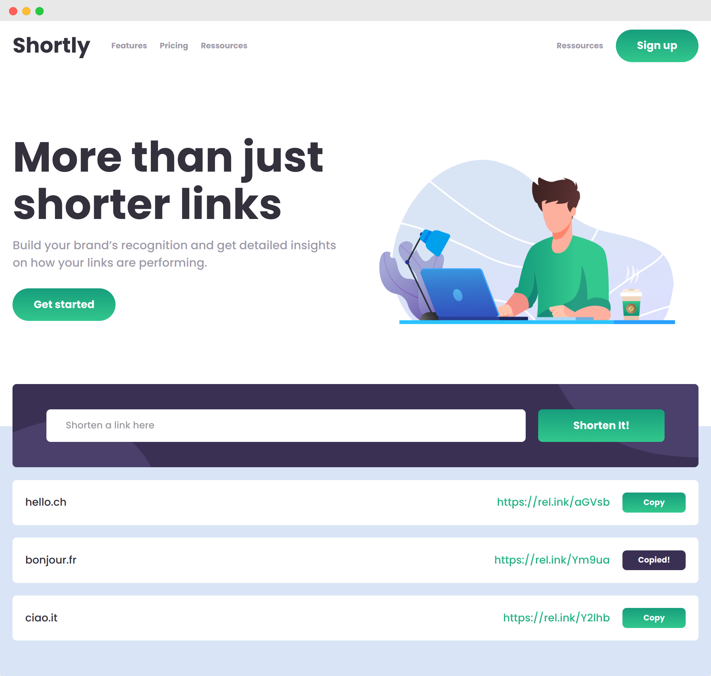

# FrontendMentor Challenge | URL Shortening API Landing-Page

This is a challenge from FrontendMentor.   
You can find the description of the task here:   
[frontendmentor.io](https://www.frontendmentor.io/challenges/url-shortening-api-landing-page-2ce3ob-G)



My goal in this challenge was to:
- Use react together with the context API and with class compnents only
- Learn how to dynamically copy text to the clipboard
- Have fun with Lotties

### How to run
```bash
git clone url-shortening-api-landing-page-fm
cd url-shortening-api-landing-page-fm
nvm use
npm install 
npm start
```